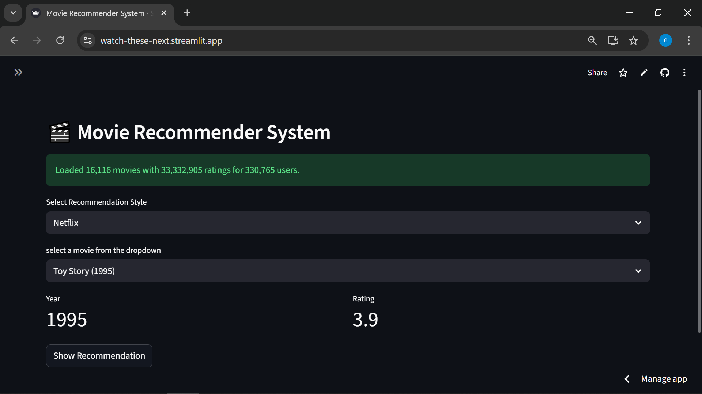
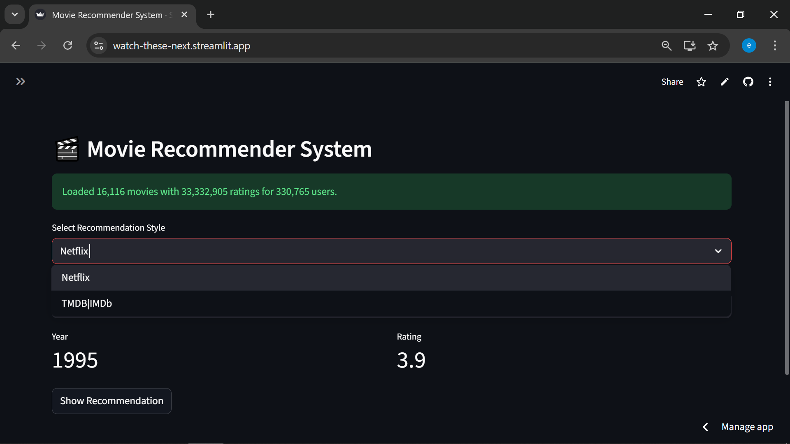
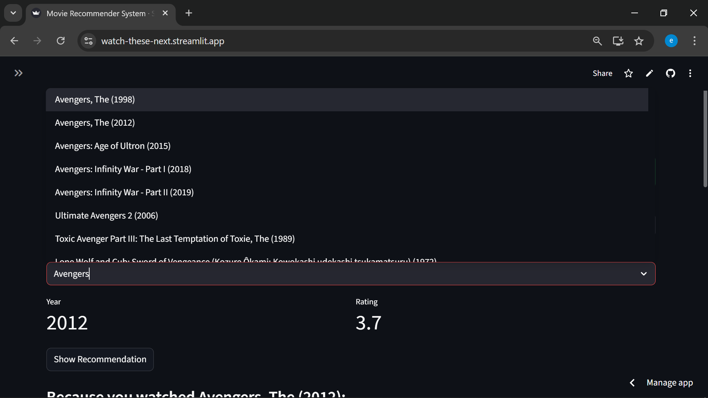
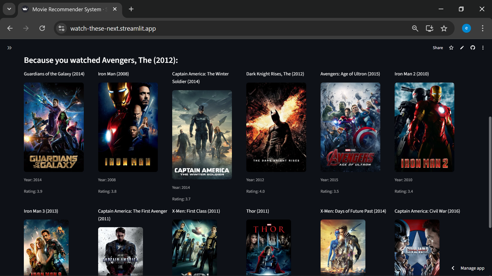

# 🎬 Movie Recommender System

An intelligent movie recommendation system using k-NN Collaborative Filtering with MovieLens dataset.

## ✨ Features

- **Smart Recommendations** using k-Nearest Neighbors algorithm
- **Two Recommendation Styles**: Netflix (diverse) and TMDB/IMDb (precise)
- **Interactive Interface** built with Streamlit
- **Comprehensive Information**: Movie posters, ratings, and release years
- **Large Dataset**: Over 80,000 movies and over 33M ratings by over 330k users

## 📸 Demo









## 🚀 Installation & Usage

### STEP 01- Clone the repository

```bash
https://github.com/RedDragon30/Movies-Recommender-System.git
```

### STEP 02- Create a environment after opening the repository

### STEP 03- Install the requirements

### STEP 04- Run the web application

### Windows

```bash
# Setup
setup.bat

# Run
run.bat
```

### Linux/Mac

```bash
# Grant execution permissions
chmod +x setup.sh

# Setup
./setup.sh

# Run
source venv/bin/activate
streamlit run app.py
```

## 📋 Requirements

- Python 3.8+
- Internet connection (for first-time data download)

## 🛠️ Technologies Used

- **Machine Learning**: scikit-learn, scipy
- **Data Processing**: pandas, numpy
- **Web Interface**: Streamlit
- **API Integration**: TMDB API
- **Download Artifacts from Google Drive**: gdown

## 📊 Project Structure

```
├── app.py                    # Main Streamlit application
├── main.py                   # Training entry point
├── src/
│   ├── data_ingestion.py     # Data ingestion
│   ├── data_preprocessing.py # Data preprocessing
│   └── model_training.py     # Model training
├── pipeline/
│   └── training_pipeline.py  # Training pipeline
└── artifacts/                # Generated files (automatic)
```

## 📝 How to Use

1. Select a movie from the dropdown list
2. Choose recommendation style (Netflix or TMDB/IMDb)
3. Click "Show Recommendation"
4. Enjoy personalized recommendations!

## 🎯 Recommendation Styles

- **Netflix**: Diverse recommendations using Cosine Similarity
- **TMDB/IMDb**: Precise recommendations using Manhattan Distance

## 👤 Developer

**Emran Albeik**

- [LinkedIn](http://linkedin.com/in/emranalbeik)
- [GitHub](https://github.com/RedDragon30)
- [Website](https://emranalbeik.odoo.com/)
- [Email](mailto:emranalbiek@gmail.com)

## 📄 License

This project is licensed under the MIT License - see the [LICENSE](LICENSE) file for details.

## 🙏 Acknowledgments

- MovieLens dataset from [GroupLens Research](https://grouplens.org/datasets/movielens/)
- Movie posters from [TMDB API](https://www.themoviedb.org/)
